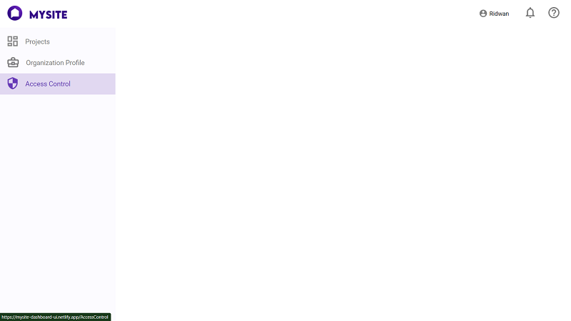
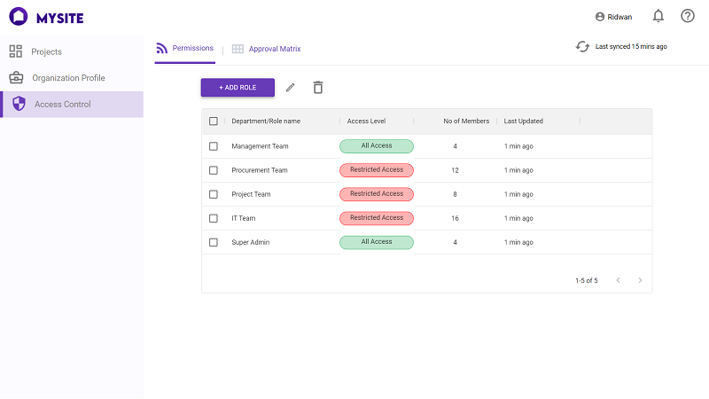
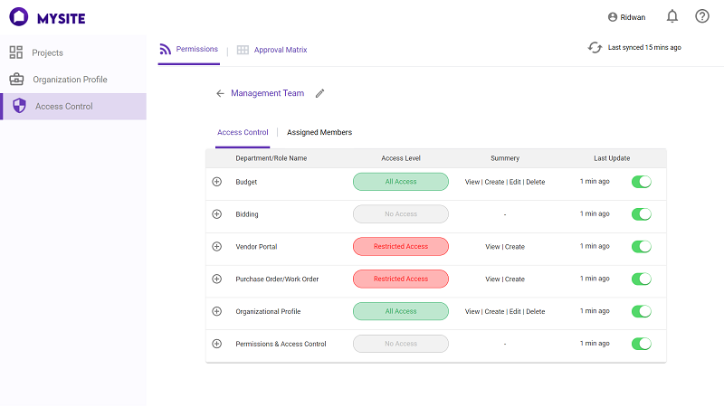
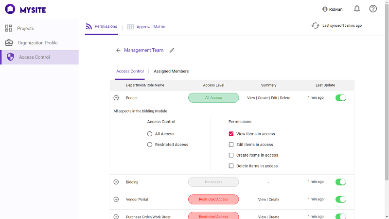

# MySite Dashboard UI 

# [Live DEMO](https://mysite-dashboard-ui.netlify.app/)
## Technology Used:
- ReactJS 
- Styled Component
- Material UI

Core Features: 
- User Find a clean dashboard in the beginning  

- After clicking on "Access Control" user can view a table

- Pressing on "Add Role" button Shown

- Manage table is expandable for managing features.

